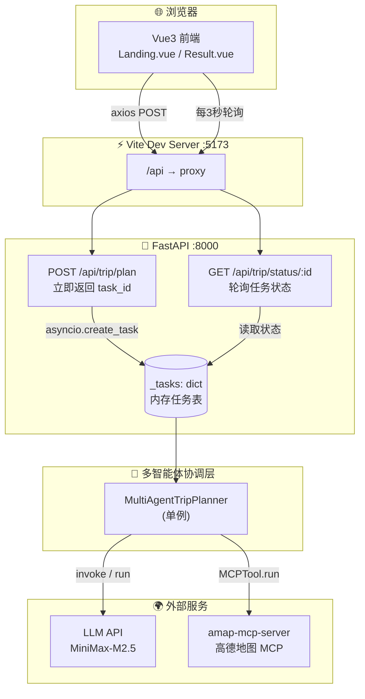
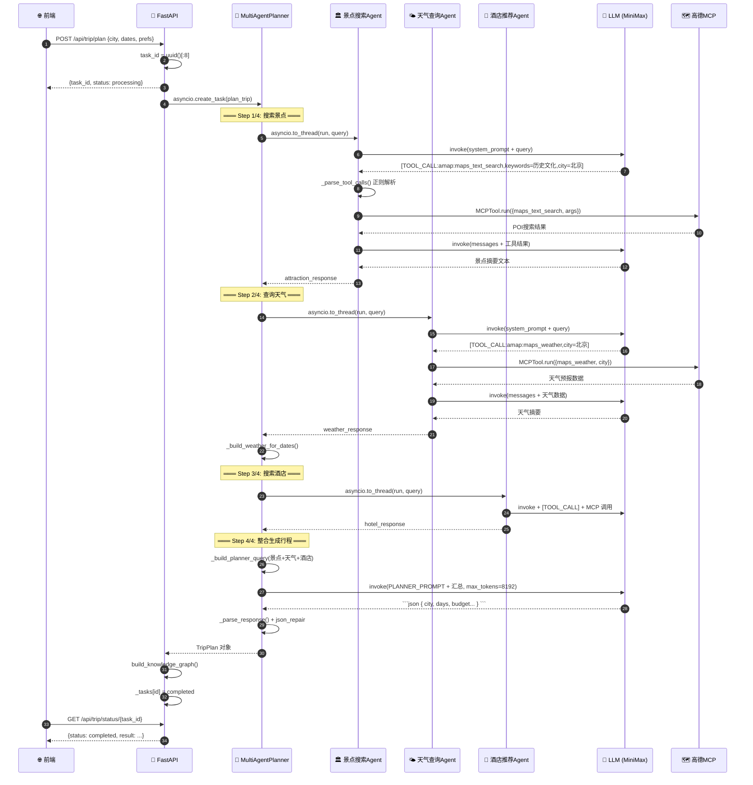
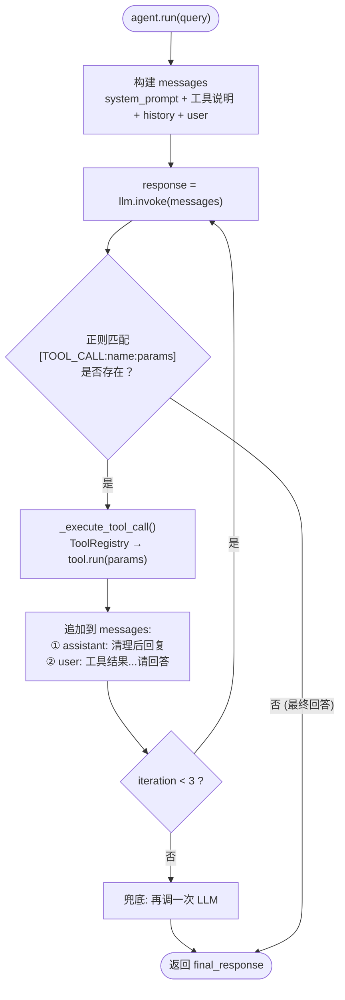
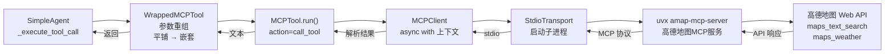
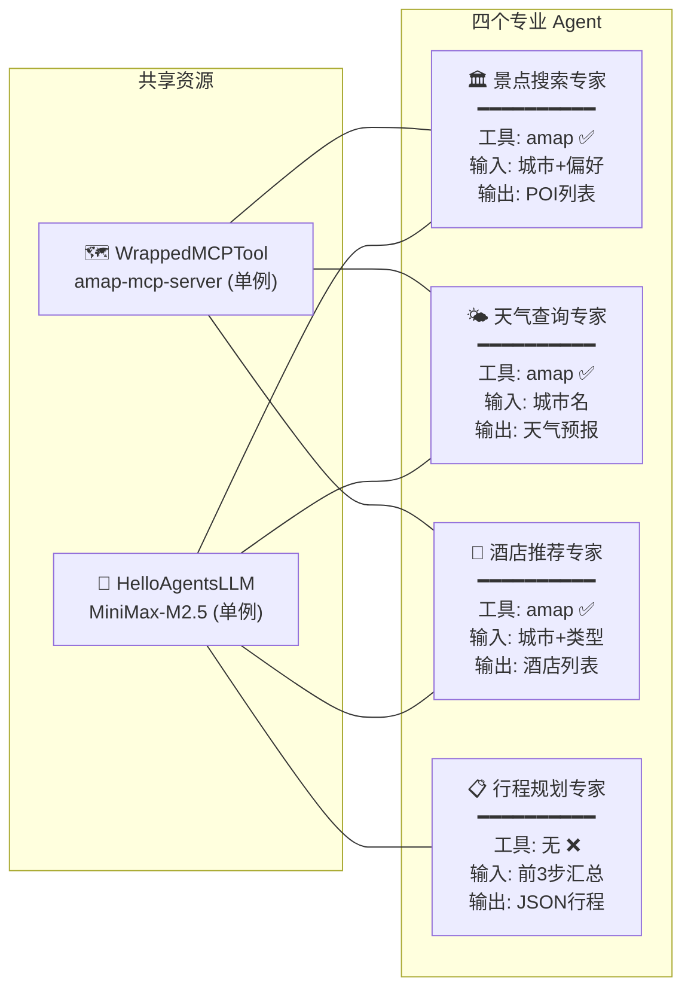

# TripStar 多智能体架构详解

> 基于 HelloAgents 框架的多 Agent 协作旅行规划系统架构文档

---

## 1. 系统整体架构

**说明：**
- 前端通过 Vite proxy 代理 `/api` 请求到后端，避免跨域
- 后端采用异步任务模式：`POST /plan` 立即返回 `task_id`，前端轮询 `GET /status` 获取结果
- 多 Agent 协调层是核心，内部编排 4 个专业 Agent 协作完成旅行规划
- 外部依赖两个服务：LLM API（文本生成）和高德地图 MCP Server（地理数据）

---

## 2. 多 Agent 协作时序图

**说明：**
- Step 1-3 各自调用一个专业 Agent，每个 Agent 内部经历 `LLM → 工具调用 → LLM 总结` 的 ReAct 循环
- Step 4 直接调用 LLM（不走 Agent），将前三步的结果汇总为结构化 JSON
- `asyncio.to_thread` 将同步的 `agent.run()` 放入线程池，不阻塞事件循环
- Step 4 有最多 3 次重试机制，确保 LLM 输出有效的 JSON

---

## 3. SimpleAgent 工具调用循环（ReAct 模式）

**说明：**
- hello_agents 的 `SimpleAgent` **不使用** OpenAI 原生 function calling
- 而是通过 prompt 约定 `[TOOL_CALL:tool_name:key=value,...]` 格式，用正则解析
- 最多循环 3 次（`max_tool_iterations`），防止无限工具调用
- 如果循环耗尽仍未得到最终回答，会兜底再调一次 LLM

---

## 4. MCP 工具调用链路

**说明：**
- `WrappedMCPTool` 是项目自定义的适配层，将 LLM 输出的平铺参数转为 MCPTool 期望的嵌套格式
- `MCPTool` 通过 `MCPClient` 管理与 MCP Server 的连接生命周期
- 底层通过 `StdioTransport` 启动 `uvx amap-mcp-server` 子进程，经 stdio 管道通信
- 最终调用高德地图 Web API 获取 POI 搜索、天气查询等数据

---

## 5. 四个 Agent 角色对比

**说明：**

| Agent | 角色 | 绑定工具 | 调用的 MCP 操作 | 输出 |
|-------|------|---------|----------------|------|
| 景点搜索专家 | 根据城市和偏好搜索景点 | `amap` ✅ | `maps_text_search` | POI 列表文本 |
| 天气查询专家 | 查询目的地天气预报 | `amap` ✅ | `maps_weather` | 天气预报文本 |
| 酒店推荐专家 | 搜索合适的酒店 | `amap` ✅ | `maps_text_search` | 酒店列表文本 |
| 行程规划专家 | 整合数据生成 JSON 行程 | 无 ❌ | — | 结构化 JSON |

---

## 6. 关键设计决策

### 异步任务 + 轮询（解决网关超时）
LLM 生成完整行程可能耗时数分钟，直接等待会导致 504。采用 `asyncio.create_task` 推入后台 + 前端每 3 秒轮询的模式。

### 文本格式工具调用（兼容任意 LLM）
不依赖 OpenAI function calling API，通过 prompt 约定 `[TOOL_CALL:...]` 格式 + 正则解析，兼容 MiniMax、豆包等国产模型。

### MCP 协议集成（解耦地图服务）
通过 MCP 协议与高德地图服务通信，地图服务作为独立子进程运行，与主应用解耦。

### 单例模式（避免重复初始化）
LLM 实例、Agent 实例、MCP 工具均为单例，避免每次请求重新建立连接。

### JSON 容错（应对 LLM 输出不稳定）
Step 4 有 3 次重试机制 + `json_repair` 库修复格式错误 + fallback 备用计划兜底。
